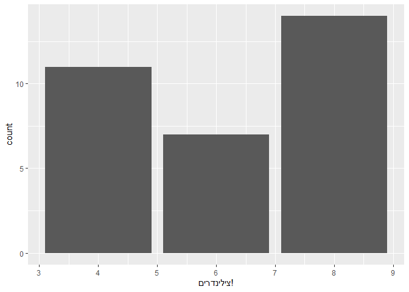

<!-- README.md is generated from README.Rmd. Please edit that file -->

# hebr

<!-- badges: start -->
<!-- badges: end -->

The goal of hebr is to help useRs handle Hebrew text within R code and
output.

## Installation

You can install the development version of hebr from
[GitHub](https://github.com/) with:

``` r
# install.packages("devtools")
devtools::install_github("matanhakim/hebr")
```

## Example

This is a basic example of fixing an RTL issue when writing in Hebrew:

``` r
library(hebr)
x <- "סימני ניקוד בסוף המשפט."
str_heb(x)
#> [1] "‫סימני ניקוד בסוף המשפט."
```

You can also use it in plots, for example:

``` r
library(ggplot2)
#> Warning: package 'ggplot2' was built under R version 4.2.2
ggplot(mtcars, aes(cyl)) +
  geom_bar() +
  xlab("צילינדרים!")
```



Notice how the exclamation mark is on the right-hand side, but it should
be on the left. use `str_heb()` to solve it, like this:

``` r
ggplot(mtcars, aes(cyl)) +
  geom_bar() +
  xlab(str_heb("צילינדרים!"))
```


Now the exclamation mark is on the left-hand side, like it should.
